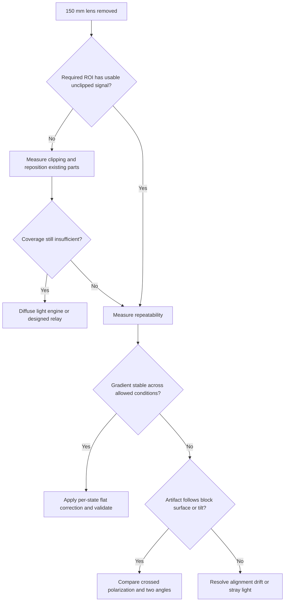

# Current illumination: broad field, flat correction, and next bench tests

Date: 2026-09-28. Status: research and test plan, not an optical prescription.

## Decision

Start with the 150 mm lens removed. The latest physical A/B test reports a
broad field with only a side-to-side gradient in that configuration. Keep the
existing collector, establish measured coverage and edge signal, then test
flat-field correction before adding optics.

The objective is reliable corrected block images. Perfect physical uniformity
is not required if stable shading can be corrected without losing useful
signal. "Works 99% of the time" remains a target, not a measured result.

## Evidence and limits

Labels below distinguish the basis of each statement:

- **Reported fact:** supplied by the user from the physical setup, not
  independently measured in this research pass.
- **Repository fact:** verified in the current project source or design record.
- **Calculation:** derived from stated assumptions; it is not a measurement.
- **Inference:** a plausible explanation or design choice to test.
- **Unknown:** data needed before a final design decision.

| Item | Evidence |
| --- | --- |
| Source | **Reported fact:** nominal 3 W white 3535 LED, approximately 3.5 mm dome and 120 degree emission specification. Dome/package size does not establish emitting-area size; nominal electrical power does not establish optical power. |
| Collector | **Reported fact:** approximately 40 mm diameter, spherical, focal length estimated near 18 mm. Exact geometry and focal data are unknown. |
| Second lens | **Reported fact:** approximately 40 mm diameter, aspheric, focal length estimated near 150 mm; approximately 180 mm from this lens to the block. Whether that distance follows the folded light path needs confirmation. |
| Earlier behavior | **Reported fact:** central hotspot with two lenses; diffuser trials did not provide sufficient useful field; a configuration described as Kohler-like gave an approximately 25 mm even spot. |
| Latest A/B test | **Reported fact:** removing the 150 mm lens produced a broad field with only a side gradient. The useful field diameter, gradient magnitude, exposure, and edge noise have not yet been recorded here. This does not yet prove a usable 60 mm field. |
| Object | **Reported fact:** block roughly 25 x 40 mm; desired field perhaps 60 mm diameter. Position and height tolerances remain undefined. |
| Apertures | **Repository fact:** `optical_setup.scad` sets a 40 mm cell port, 38 mm carrier aperture, 45 mm cube opening, and a 50 x 50 mm beamsplitter at 45 degrees. Verify the actual installed configuration. |
| Old prescription | **Repository fact:** `DESIGN.md` section 9 and a source comment assume 16/40 mm focal lengths and 56 mm lens separation. Those assumptions do not describe the current estimated 18/150 mm optics. No source or design parameters were changed by this note. |

**Inference:** the latest A/B result makes the second lens the first component
to leave out. It implicates that lens's role in the tested layout, not a defect
in the lens or proof that every condenser is unsuitable.

## What the geometry does and does not imply

**Calculation:** a centered 25 x 40 mm rectangle needs a circular field of at
least `sqrt(25^2 + 40^2) = 47.2 mm` to cover its corners. A 60 mm target adds
placement margin; determine whether that margin is actually needed.

**Calculation:** a 50 mm plate at 45 degrees presents approximately
`50 cos(45 degrees) = 35.4 mm` in one projected direction, before mounting or
coating margins. Together with the 38 mm carrier aperture, this rules out a
60 mm parallel beam through the present assembly. It does **not** rule out a
60 mm expanding field at the more distant object plane.

**Calculation, ideal thin-lens model:** if the LED is one focal length before
the first lens, the lenses are separated by `f1 + f2`, and the target is one
focal length after the second lens, the system images the LED at magnification
`f2 / f1 = 150 / 18 = 8.3`. An apparent 3 mm emitter would become a 25 mm image.
That makes source imaging a possible explanation of the earlier spot. The
actual emitter size, lens geometry, and spacings are unknown, so this is not a
diagnosis of the bench setup.

**Primary-source principle:** Kohler illumination requires two distinct
mappings: the source is imaged into an aperture plane, while a field stop is
imaged onto the specimen. Two positive lenses at `f1 + f2` spacing do not by
themselves establish those mappings. [Nikon: conjugate planes](https://www.microscopyu.com/microscopy-basics/conjugate-planes-in-optical-microscopy)

**Calculation, ideal thin-lens model:** a 150 mm lens forming an image at
180 mm requires an object distance of 900 mm and gives 0.2x magnification.
It is therefore not a straightforward choice for magnifying a nearby small
uniform source onto this block plane. Principal-plane locations and the other
lens alter the complete system, so this is a design screen rather than a
spacing instruction.

**Calculation:** spreading unchanged captured flux from a 25 mm circle to a
60 mm circle reduces average irradiance to `(25 / 60)^2 = 0.174`, about 17%.
Coverage, brightness and angular spread must be considered together. Extended
sources also retain divergence after collimation. [Edmund: collimation](https://www.edmundoptics.com/knowledge-center/application-notes/optics/considerations-in-collimation/)

## Cost-ranked architecture ladder

This is an order for experiments, not verified pricing or a shopping list.
Reprints and changes to existing parts come first. No purchases are proposed
until the cheaper measurements show what is missing.

| Priority | Architecture or change | Why try it | Evidence required before moving on |
| --- | --- | --- | --- |
| 1, existing parts/reprints | Remove the 150 mm lens; center and reposition the LED/collector; adjust or reprint holders only if the physical mount prevents alignment | The reported A/B test already gives a broad field; the remaining gradient may be correctable | Measured ROI coverage, unsaturated center, usable edge signal, repeated gradient map |
| 2, existing camera/software | Dark subtraction and a separate flat correction for each fixed illumination state | Corrects repeatable shading without adding optical parts | Corrected matte-reference residuals and real-block performance across allowed positions/heights |
| 3, inexpensive optical experiment | Crossed source and camera polarizers | Direct test of whether the troublesome bright regions are polarized glare | Exposure-normalized comparison, remaining tissue contrast, wax/plastic artifacts, edge signal |
| 4, small source/mount change | Alternate two laterally offset LEDs or first reposition the same LED for A/B captures | Tests whether different angles provide complementary usable views | Full coverage for each state, separate flats, stable registration, evidence that one frame rescues regions lost in the other |
| 5, larger printable light engine | Diffuse panel or reflective mixing cavity feeding the existing beamsplitter | Creates an extended luminous source when the single emitter remains too sensitive | Target-plane uniformity and real-block contrast at the required working distance; aperture compatibility |
| 6, specialty optics, roughly $150 budget class | Homogenizing rod/array plus a designed relay, or a purpose-selected condenser/illumination module | Appropriate only if measured field or angular requirements defeat simpler options | Actual prescription, clear apertures, working distance, throughput and an explicit acceptance test before purchase |

The last row is a spending tier, **not a current product quote**. A specialty
part alone does not guarantee a complete uniform illumination system.

**Primary-source precedent:** CCS coaxial lights combine an LED array,
adjustable diffusion plate and half mirror. The diffuser's position and
transmission affect the illumination. [CCS LFV3 architecture](https://www.ccs-grp.com/products/series/150)

**Primary-source precedent:** a light pipe mixes illumination through internal
reflections. Its output still needs a suitable projection or coupling system.
[Edmund: light pipes](https://www.edmundoptics.com/knowledge-center/video/tutorials/light-pipe-overview/)

## Flat correction: what it can recover

**Primary-source principle:** flat correction compensates repeatable sensor
response variation and illumination/lens shading.
[Basler: flat-field correction](https://docs.baslerweb.com/flat-field-correction)

| Usually suitable for flat correction | Requires another remedy or a rejected capture |
| --- | --- |
| Smooth gradient fixed relative to the camera | Saturated glare: clipped detail is missing |
| Stable optical vignetting with adequate signal | Dark edges where noise dominates the wanted signal |
| Repeatable per-channel response | Highlights or shadows that move with block position or tilt |
| Stable differences between LED states, using a flat for each | Sample-dependent additive flare or changes after optics move |

**Model:** for linear image `I`, averaged dark frame `D`, and averaged flat
`F`, a basic correction is `(I - D) / (F - D)` times a chosen normalization.
Mask invalid or near-zero denominators; do not present amplified noise as
recovered detail. The flat target must have uniform reflectance, fill the ROI,
and sit at the relevant block height. Paper is useful for an initial comparison
but its texture and nonuniformity should not become the calibration pattern.

**Unknown:** fixed AE/AWB-off capture settings help repeatability but do not
establish a linear image pipeline. Confirm raw or otherwise linear data,
black-level handling, exposure, gain, lens aperture and existing shading
correction before judging a numerical correction.

## Two alternating LEDs: useful hypothesis, separate test

**Inference:** two angles can provide complementary views of specular glare.
They do not replace coverage or per-state flat correction.

- Move the source **across** the optical axis in the same source plane to
  test direction changes. Moving it **along** the axis mainly changes focus
  and cone width. "Different heights" changes angle only when height is
  transverse to light propagation in that part of the system.
- **Calculation, simple collimator only:** 1 mm lateral offset at an 18 mm
  focal length corresponds to approximately `1 / 18 rad = 3.2 degrees`.
  The full optical train determines the actual block illumination angle.
- **Inference from an ideal matte-surface model:** averaging equal opposite
  angles can cancel one component of slope shading. Shadows, specular
  highlights and other surface effects remain.
- Preserve A and B separately. Normalize each with its own flat and check
  registration. A blind pixelwise minimum can select shadows and noise;
  averaging does not remove a highlight present in one frame. Test selection
  or weighted fusion only where at least one frame contains usable signal.
- If both frames clip or both lose the same region in darkness, fusion cannot
  recover it. Do not claim a general texture-free reflectance image from two
  views.

**Primary-source principle:** crossed source/camera polarizers can suppress
specular hotspots, but reduce throughput and can reveal polarization changes
in stressed transparent material. Compare this with angle diversity using
matched exposure and real blocks. [Edmund: polarization techniques](https://www.edmundoptics.com/knowledge-center/application-notes/illumination/successful-light-polarization-techniques)

## Decision tree

## Bench-return checklist

- [ ] **Define success:** select the actual ROI, permitted placement and
  height range, maximum exposure and a failure criterion. Define what the
  requested 99% success rate counts before testing it.
- [ ] **Record geometry:** photograph the current arrangement with a ruler;
  record source-to-collector, collector-to-second-lens when present,
  last-lens-to-splitter and splitter-to-block distances. Mark lens orientations
  and carrier positions. Confirm whether the stated 180 mm follows the folded
  light path.
- [ ] **Repeat the key A/B:** hold LED current, camera settings, block plane
  and remaining optics fixed; capture second lens installed and removed.
  Record field width in millimeters, center/edge levels and clipped pixels.
- [ ] **Separate lighting from surface response:** capture a dark frame, a
  matte reference at block height, then a glossy real block. A hotspot only on
  the block points toward surface-dependent glare rather than simple shading.
- [ ] **Test correction stability:** capture the reference at the intended
  center/corner positions and minimum/maximum heights; repeat after warm-up.
  Plot a brightness map and horizontal/vertical profiles before and after
  correction. Record residual variation and repeat noise.
- [ ] **Test real specimens:** include pale tissue, dark tissue, smooth wax,
  scratched wax and glossy cases. Repeat controlled positions and small tilts.
  Evaluate retained tissue boundaries and contrast, not only a flatter image.
- [ ] **Try angle/polarization changes only when indicated:** first move one
  source for sequential A/B tests if practical; then decide whether a second
  LED is justified. Keep separate originals and flats for each state.
- [ ] **Choose the next change from the measured failure:** alignment for a
  gradient, exposure/throughput for weak edges, glare control for surface
  reflections, and a new light engine only for persistent coverage or angular
  limitations. Optical success requires these bench results; CAD fit alone
  does not establish it.

## Open requirements

The final architecture still depends on the useful field and placement margin,
the angular distribution needed for tissue contrast, actual lens prescriptions,
the splitter's clear coated aperture, allowable exposure and duty cycle,
temperature stability, and whether one calibration survives the permitted block
height and tilt range. Uniform appearance on a matte reference does not alone
establish uniform appearance on wax.
