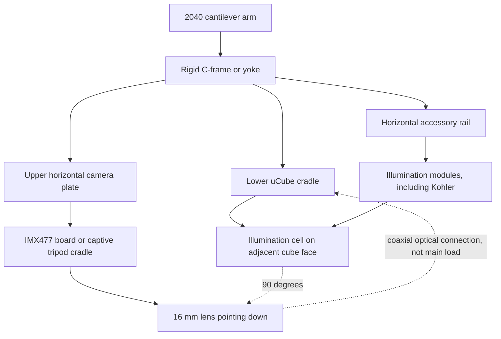

# Optical head frame integration concepts

**Status:** Brainstorming record, not an adopted geometry decision  
**Date:** 2026-08-16

## Problem

The current lab setup clamps the 16 mm lens. The uCube screws onto the front of
the lens, and the illumination cell bolts to the uCube. This makes the lens
barrel the structural spine for the entire optical head.

That arrangement has three problems:

1. The camera, uCube, and illumination cell form a long twisting lever around
   the lens clamp.
2. Tightening or bumping any downstream part can rotate or tilt the optical
   assembly.
3. The frame does not independently constrain the camera axis, cube position,
   or illumination axis.

The lens connection should locate the optical path. It should not be the main
structural load path.

## Design principle

Use **two strong load paths and one shared datum**:

- Support the uCube directly from a lower cradle attached to the extrusion.
- Support the camera directly from a separate upper plate attached to the same
  rigid C-frame or yoke.
- Keep the camera lens axis vertical and coaxial with the center of the uCube.
- Keep the lens-to-uCube connection for coaxial optical alignment and light
  sealing, with little or no structural load.
- Let the uCube side face establish the illumination axis at 90 degrees to the
  vertical camera axis.

The camera and uCube are not orthogonal to each other. Their centers are on the
same vertical optical axis. The orthogonal relationship is between that camera
axis and the horizontal illumination axis.

## Recommended concept

### 1. Rigid C-frame or yoke

Mount one stiff C-frame below the cantilever extrusion. Its upper shelf carries
the camera and its lower shelf or cradle carries the uCube. This frame becomes
the master mechanical datum for the complete optical head.

The frame should:

- Bolt to at least two T-nuts along the extrusion, not one central bolt.
- Span enough of the arm to resist yaw and roll.
- Use two separated ribs, side rails, or metal angles so the upper and lower
  supports remain parallel.
- Include registers or dowel features so screw clearance does not define
  alignment by itself.
- Leave the top lens opening and the used horizontal cube face unobstructed.

The pictured arm appears similar to 2040 extrusion, but its actual profile and
slot spacing must be measured before modeling.

### 2. Independent uCube support

Support the uCube independently using a lower shelf, perimeter ring, or two
opposed side brackets. The top face must remain open for the downward-looking
camera lens.

- A close-fitting register around the cube exterior provides repeatable X/Y
  location and prevents rotation.
- Fasteners into unused uCube faces or corner structure provide clamping.
- The lower cradle carries the cube, beamsplitter face, and illumination-cell
  loads directly into the C-frame.
- The cradle must not block the top camera port, the horizontal illumination
  port, or the required sample/object port.

The uCube becomes the local optical datum. Its vertical centerline defines the
camera axis, and its side face defines the horizontal illumination axis.

### 3. Independent camera support

Attach a horizontal camera plate above the uCube to the same C-frame. The plate
supports the IMX477 camera while its 16 mm lens points vertically downward into
the top uCube face.

Two camera attachment approaches are viable:

| Approach | Strengths | Risks | Best use |
| --- | --- | --- | --- |
| Four PCB holes on 30 mm square pitch | Positive anti-rotation, compact, repeatable | Requires correct standoffs, screw length, back-side keepouts, and cable access | Final rigid instrument |
| Captive tripod-foot cradle with one 1/4-20 bolt | Does not load the PCB, fast to install | The screw alone is one point, so the cradle must add a broad base and two side cheeks | First prototype or removable camera |

The tripod version is not a single-contact mount if the foot sits in a fitted
pocket. The bolt supplies clamp force, while the base plane and two locating
walls prevent yaw and rotation.

For the final fixed setup, the four PCB holes are the more direct way to make
the camera body independently rigid. Use four equal-height standoffs and verify
component clearance on the rear of the board.

### 4. Avoid fighting constraints

The M37 lens-to-uCube thread and the separate camera plate can both constrain
the same camera position. If they are tightened while misaligned, they can bend
the camera plate, load the lens barrel, or tilt the uCube.

Use this assembly sequence:

1. Rigidly mount and square the uCube in the lower cradle.
2. Loosely mount the IMX477 camera in the upper plate.
3. Lower or slide the camera plate until the 16 mm lens engages the top uCube
   interface without side load.
4. Use slots or thin shims to remove any gap and align the support.
5. Tighten the camera support while watching for image shift.
6. Mark the final shim stack or slot position for repeatable reassembly.

The camera support should be stiff after tightening, but vertically adjustable
during first alignment. Long vertical slots in the C-frame, or shims under the
camera plate, prevent the support from steering the lens.

### 5. Illumination cell support

The illumination cell should remain bolted to the adjacent uCube face. That
face establishes its 90-degree relationship to the camera axis.

If physical testing shows far-end sag, add a light vertical hanger from the
head plate to the far end of the cell. Use a slot at the hanger so it carries
vertical weight without pulling the cell sideways or redefining its optical
axis.

### 6. Expansion interface for Köhler illumination

Do not make the uCube carry a long train of future illumination optics. Add a
horizontal accessory rail whose centerline is fixed to the center of the
illumination uFace, but whose structural load returns directly to the C-frame
or main extrusion.

The uFace then provides optical registration and light sealing. The rail carries
the mass and bending moment.

A future epi-illumination train could provide independently sliding modules for:

1. LED or other source.
2. Collector lens.
3. Field diaphragm.
4. Relay optics.
5. Aperture diaphragm at the appropriate conjugate plane.
6. Condenser or final coupling lens into the uCube.

Exact order and spacing must follow the chosen Köhler optical prescription. The
mechanical requirement now is to preserve enough rail length and give every
module the same horizontal optical center height.

Possible rail standards:

| Rail | Strengths | Risks |
| --- | --- | --- |
| Two parallel cage rods | Strong control of rotation and optical center | Requires accurate rod spacing and parallelism |
| Dovetail optical rail | Rigid and easy to reposition | Purchased hardware can be expensive |
| 2020 extrusion with registered carriages | Matches the stand and is inexpensive | A single slot does not guarantee optical-axis rotation without a keyed carriage |

The most important requirement is two separated locating features. A single
round rod or one loose T-slot leaves module roll underconstrained.

Reserve a similar vertical expansion zone above the uCube. A removable spacer
or vertically sliding camera plate would allow future filters, analyzers, or
relay optics between the cube and camera without redesigning the C-frame.

## Structural load paths

- Camera: camera board or tripod cradle -> upper plate -> C-frame ->
  extrusion.
- uCube and beamsplitter: lower cradle -> C-frame -> extrusion.
- Illumination cell: uCube face -> lower cradle -> C-frame -> extrusion.
- Optional cell support: far-end hanger -> C-frame -> extrusion.
- Future illumination train: accessory rail -> C-frame or extrusion.
- Lens connection: optical centering and sealing, not the primary support.

## Orthogonality checks

Mechanical squareness is necessary but not sufficient. Validate in this order:

1. Check the C-frame against the extrusion with a machinist square.
2. Check that the upper camera plate and lower cube cradle are parallel.
3. Confirm the uCube is seated against its register before tightening screws.
4. Project or image a centered target through the system and watch for image
   shift while tightening the camera support.
5. Confirm the vertical camera axis is centered through the top and bottom cube
   openings.
6. Confirm the illumination axis enters through the center of its horizontal
   uCube face at 90 degrees to the camera axis.
7. Recheck after attaching the illumination cell, because its cantilever load
   can reveal cube or arm flex.

## Pulled reference models

Reference meshes are stored under
`vendor/raspi-hq-camera-reference/`:

- `HQ_Camera_model.stl`
- `Lens_16mm_model.stl`
- `raspi_HQ_cam_and_16mm_lens.stl`

They came from David Crook's community OpenSCAD model at commit
`4951fc2d117aa58dec62e8bc2101ca5e6f0dc89c` and are licensed CC BY-SA
4.0. They are reference envelopes, not official manufacturing CAD.

The main dimensions were checked against Raspberry Pi's current documents:

- HQ camera PCB: 38 x 38 mm.
- Four board holes: 30 mm square pitch.
- Tripod thread: 1/4-20 UNC.
- 16 mm lens: approximately 39 mm diameter by 50 mm nominal length.

## Dimension authority

The concept render deliberately separates known component geometry from
provisional support geometry.

| Item | Current value | Authority | Status |
| --- | ---: | --- | --- |
| uCube overall size | 73 mm | `DESIGN.md` and current source | Locked physical measurement |
| uCube clear opening | 45 mm | `DESIGN.md` and current source | Locked physical measurement |
| uFace size | 59 x 59 x 3.5 mm | `DESIGN.md` and current source | Locked project geometry |
| uFace corner screw pitch | 52 mm square | `DESIGN.md` and current source | Locked project geometry |
| IMX477 HQ camera PCB | 38 x 38 mm | Raspberry Pi drawing | Official |
| Camera PCB holes | 30 mm square pitch, nominal 2.5 mm | Raspberry Pi drawing | Official, verify the physical board before screw selection |
| Camera tripod thread | 1/4-20 UNC | Raspberry Pi drawing | Official |
| 16 mm lens envelope | 39 mm diameter x 50 mm nominal length | Raspberry Pi documentation | Official envelope |
| Combined camera and lens mesh | 39 x 51.7 x 72.0222 mm bounding box | Imported community reference mesh | Packaging reference only |
| Beamsplitter | 50 x 50 x 2.5 mm | Physical measurement recorded in this project | Measured |
| Extrusion profile and slot spacing | Unknown | Must measure the pictured stand | Do not infer from the image |
| C-frame thickness, shelf spacing, and fasteners | Unknown | Depends on measured stand and chosen material | Concept only |
| Köhler rail spacing and module lengths | Unknown | Depends on the optical prescription | Concept only |

The black camera/lens mesh, uCube shell, and blue illumination cell in the
concept render use the available reference geometry. The orange C-frame and
green accessory rail are spatial sketches. They are not printable support
parts and should not be used for fabrication.

Sources:

- [Raspberry Pi HQ camera mechanical drawing](https://datasheets.raspberrypi.com/hq-camera/hq-camera-mechanical-drawing.pdf)
- [Raspberry Pi camera documentation](https://www.raspberrypi.com/documentation/accessories/camera.html)
- [Community reference model source](https://github.com/idcrook/psychic-winner/tree/main/raspi_cam_hq_models)

## Measurements needed before CAD

- Exact extrusion profile, likely 2040 but not yet confirmed.
- T-slot center spacing and available arm length above the uCube.
- Desired cube center height above the sample.
- Physical camera PCB hole diameter and rear-component keepouts.
- Camera ribbon-cable exit direction and minimum bend clearance.
- Actual lens-to-camera assembled length at the working focus setting.
- Accessible top-face screw locations on the assembled uCube.
- Total mass and observed sag of the illumination cell.
- Desired accessory-rail standard and the maximum planned Köhler train length.
- Required clear aperture for future diaphragms, filters, and relay optics.

## First prototype boundary

Model only these pieces first:

1. One extrusion-to-C-frame interface.
2. One registered lower uCube cradle that leaves the top port open.
3. One vertically adjustable upper camera plate, initially using either the
   four board holes or a captive tripod-foot cradle.
4. One removable illumination-rail datum aligned to the center of the active
   horizontal uCube face.

Do not redesign the beamsplitter face, M37 camera face, or illumination cell
until the shared-frame support is physically checked.
