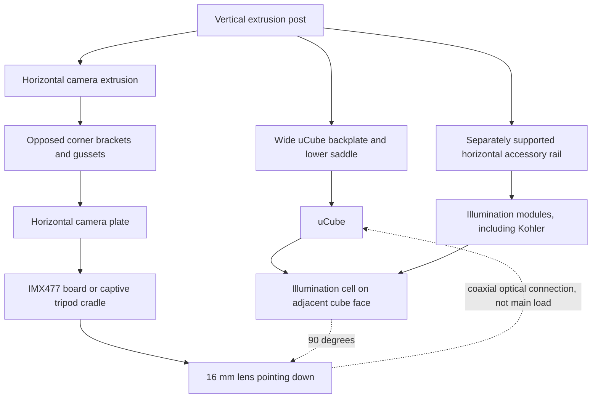

# Optical head frame integration concepts

**Status:** Brainstorming record, not an adopted geometry decision  
**Date:** 2026-08-16

## Problem

The current lab setup clamps the 16 mm lens. The uCube screws onto the front of
the lens, and the illumination cell bolts to the uCube. This makes the lens
barrel the structural spine for the entire optical head.

That arrangement has three problems:

1. The camera, uCube, and illumination cell form a long twisting lever around
   the lens clamp.
2. Tightening or bumping any downstream part can rotate or tilt the optical
   assembly.
3. The frame does not independently constrain the camera axis, cube position,
   or illumination axis.

The lens connection should locate the optical path. It should not be the main
structural load path.

## Design principle

Use **two strong load paths and one shared post datum**:

- Support the uCube directly from a broad adapter on the vertical extrusion.
- Support the camera directly from a separate horizontal extrusion and camera
  plate above the cube.
- Keep the camera lens axis vertical and coaxial with the center of the uCube.
- Keep the lens-to-uCube connection for coaxial optical alignment and light
  sealing, with little or no structural load.
- Let the uCube side face establish the illumination axis at 90 degrees to the
  vertical camera axis.

The camera and uCube are not orthogonal to each other. Their centers are on the
same vertical optical axis. The orthogonal relationship is between that camera
axis and the horizontal illumination axis.

## Recommended concept

### 1. Broad post interface, not a one-tab hanger

The small single contact shown in the first concept is not acceptable. Both
supports must spread load across the vertical extrusion.

The camera arm should meet the post with two opposed metal corner brackets or
gussets, preferably backed by a plate that uses multiple T-nuts. The uCube
adapter should contact the post over a tall, flat region with upper and lower
fasteners. If the post exposes two slot columns, use both columns to create a
rectangular four-bolt pattern.

The screws provide clamp force. Broad mating faces, gussets, shoulders, and
keys should define squareness and carry shear. One screw or one small printed
tab should not define the pose of either optical assembly.

The stand uses standard 2020 T-slot extrusion, so the outside section is 20 x
20 mm with one centered slot on each face. A single face therefore cannot
provide a two-column bolt pattern. Use two vertically separated fasteners in
the rear slot plus wraparound features or fasteners into the side slots.

### 2. Direct post-mounted uCube adapter

**Status: built as `post_mount` (render mode 16).** What follows is the concept.
See "As-built post_mount" at the end of this document for what was actually
modeled and where it departs from the concept.

The preferred cube support is a replacement rear uFace that grows into a
post-mounting backplate. It uses the existing four M3 face screws on a 52 mm
square pitch, so the uCube remains registered by its normal face geometry. The
plate extends above and below the 73 mm cube so its T-slot bolts remain
accessible after the cube is installed.

Add a short horizontal saddle under the cube and two shallow side cheeks:

- The saddle carries gravity in compression instead of asking the four M3
  screws to carry all weight in shear.
- The side cheeks register the 73 mm cube and resist yaw.
- The four uFace screws clamp the cube against the adapter.
- Upper and lower post bolts, widely separated along the post, resist pitch.
- Two wraparound post saddles, one above and one below the cube center, contact
  the front and side faces of the 20 x 20 mm post. Side-slot fasteners or fitted
  side walls resist roll and yaw better than relying on friction in one slot.

This adapter belongs on an unused face, preferably opposite the illumination
cell. It must leave the top camera port, bottom/sample path, illumination port,
and all needed face screws accessible.

A machined aluminum backplate with printed locator blocks is the stiffest
version. A fully printed PETG or nylon saddle is appropriate for the first fit
test, but it should have broad ribs and should not be treated as a proven final
instrument mount until deflection is measured.

The uCube becomes the local optical datum. Its vertical centerline defines the
camera axis, and its side face defines the horizontal illumination axis.

### 3. Independent camera support on a horizontal extrusion

Attach a horizontal extrusion above the uCube. Join it to the vertical post
with opposed corner brackets or gussets on both sides, not one small connector.
A camera plate spans between two brackets below the horizontal extrusion and
supports the IMX477 camera while its 16 mm lens points vertically downward into
the top uCube face.

Two camera attachment approaches are viable:

| Approach | Strengths | Risks | Best use |
| --- | --- | --- | --- |
| Four PCB holes on 30 mm square pitch | Positive anti-rotation, compact, repeatable | Requires correct standoffs, screw length, back-side keepouts, and cable access | Final rigid instrument |
| Captive tripod-foot cradle with one 1/4-20 bolt | Does not load the PCB, fast to install | The screw alone is one point, so the cradle must add a broad base and two side cheeks | First prototype or removable camera |

The tripod version is not a single-contact mount if the foot sits in a fitted
pocket. The bolt supplies clamp force, while the base plane and two locating
walls prevent yaw and rotation.

For the final fixed setup, the four PCB holes are the more direct way to make
the camera body independently rigid. Use four equal-height standoffs and verify
component clearance on the rear of the board.

### 4. Avoid fighting constraints

The M37 lens-to-uCube thread and the separate camera plate can both constrain
the same camera position. If they are tightened while misaligned, they can bend
the camera plate, load the lens barrel, or tilt the uCube.

Use this assembly sequence:

1. Rigidly mount and square the uCube on the post adapter and lower saddle.
2. Loosely mount the IMX477 camera in the camera plate.
3. Lower or slide the camera plate until the 16 mm lens engages the top uCube
   interface without side load.
4. Use slots or thin shims to remove any gap and align the support.
5. Tighten the camera support while watching for image shift.
6. Mark the final shim stack or slot position for repeatable reassembly.

The camera support should be stiff after tightening, but vertically adjustable
during first alignment. Slots in the paired camera brackets, or shims under the
camera plate, prevent the support from steering the lens.

### 5. Illumination cell support

The illumination cell should remain bolted to the adjacent uCube face. That
face establishes its 90-degree relationship to the camera axis.

If physical testing shows far-end sag, add a light vertical hanger from the
head plate to the far end of the cell. Use a slot at the hanger so it carries
vertical weight without pulling the cell sideways or redefining its optical
axis.

### 6. Expansion interface for Köhler illumination

Do not make the uCube carry a long train of future illumination optics. Add a
horizontal accessory rail whose centerline is fixed to the center of the
illumination uFace, but whose structural load returns directly to the vertical
post or base frame.

The uFace then provides optical registration and light sealing. The rail carries
the mass and bending moment.

A future epi-illumination train could provide independently sliding modules for:

1. LED or other source.
2. Collector lens.
3. Field diaphragm.
4. Relay optics.
5. Aperture diaphragm at the appropriate conjugate plane.
6. Condenser or final coupling lens into the uCube.

Exact order and spacing must follow the chosen Köhler optical prescription. The
mechanical requirement now is to preserve enough rail length and give every
module the same horizontal optical center height.

Possible rail standards:

| Rail | Strengths | Risks |
| --- | --- | --- |
| Two parallel cage rods | Strong control of rotation and optical center | Requires accurate rod spacing and parallelism |
| Dovetail optical rail | Rigid and easy to reposition | Purchased hardware can be expensive |
| 2020 extrusion with registered carriages | Matches the stand and is inexpensive | A single slot does not guarantee optical-axis rotation without a keyed carriage |

The most important requirement is two separated locating features. A single
round rod or one loose T-slot leaves module roll underconstrained.

Reserve a similar vertical expansion zone above the uCube. A removable spacer
or vertically sliding camera plate would allow future filters, analyzers, or
relay optics between the cube and camera without redesigning the post mounts.

## Structural load paths

- Camera: camera board or tripod cradle -> camera plate -> paired brackets ->
  horizontal extrusion -> opposed post gussets -> vertical post.
- uCube and beamsplitter: cube body -> rear mounting uFace -> lower saddle and
  tall backplate -> multiple T-nuts -> vertical post.
- Illumination cell: uCube face -> post-mounted cube adapter -> vertical post.
- Optional cell support: far-end hanger -> post or base frame.
- Future illumination train: accessory rail -> post or base frame.
- Lens connection: optical centering and sealing, not the primary support.

## Orthogonality checks

Mechanical squareness is necessary but not sufficient. Validate in this order:

1. Check the uCube backplate against the post with a machinist square.
2. Check the horizontal camera extrusion at 90 degrees to the post.
3. Check that the camera plate is parallel to the top uCube face.
4. Confirm the uCube is seated on its saddle and side registers before
   tightening screws.
5. Project or image a centered target through the system and watch for image
   shift while tightening the camera support.
6. Confirm the vertical camera axis is centered through the top and bottom cube
   openings.
7. Confirm the illumination axis enters through the center of its horizontal
   uCube face at 90 degrees to the camera axis.
8. Recheck after attaching the illumination cell, because its cantilever load
   can reveal cube or arm flex.

## Stability check before calling the mount complete

The image is not enough to certify stiffness. The post profile, arm length,
bracket material, fasteners, and real assembly mass are still unknown.

The current active STL set has about 404 cm3 of printed material including the
uCube shell and `post_mount`. At 1.24 g/cm3 this is roughly 502 g of PLA at 100
percent material density. This is only a mesh-volume estimate. It does not include the camera,
lens, glass, LEDs, wiring, fasteners, unused faces, or slicer-dependent infill
and wall settings. Weigh the complete physical head instead of using this
estimate for the final calculation.

For each cantilevered load, calculate the post-joint moment from
`moment = mass x 9.81 x horizontal reach`, using kilograms and meters. Then use
the real extrusion manufacturer's section data and the actual bracket pattern
to check deflection. Do not certify a profile guessed from the screenshot.

Physical proof test:

1. Square and focus the complete system on a fixed crosshair target.
2. Record the target position in camera pixels.
3. Add a temporary 1.5 times service load at the real center-of-mass location.
4. Record camera-to-cube image shift, not only motion of the extrusion tip.
5. Remove the load and confirm the image returns with no permanent shift.
6. Attach and remove the illumination cell and repeat, because it produces the
   strongest twisting load on the cube adapter.
7. Recheck every T-slot fastener after the first several assembly cycles.

Set the allowable pixel shift from the imaging experiment. A made-up mechanical
deflection limit would not prove that the optical result is acceptable.

Also inspect the upright-to-base joint. If the visible triangular plate is the
only base gusset, add an opposed gusset or backing plate so the whole post does
not rack even when the optical head itself is stiff.

## Pulled reference models

Reference meshes are stored under
`vendor/raspi-hq-camera-reference/`:

- `HQ_Camera_model.stl`
- `Lens_16mm_model.stl`
- `raspi_HQ_cam_and_16mm_lens.stl`

They came from David Crook's community OpenSCAD model at commit
`4951fc2d117aa58dec62e8bc2101ca5e6f0dc89c` and are licensed CC BY-SA
4.0. They are reference envelopes, not official manufacturing CAD.

The main dimensions were checked against Raspberry Pi's current documents:

- HQ camera PCB: 38 x 38 mm.
- Four board holes: 30 mm square pitch.
- Tripod thread: 1/4-20 UNC.
- 16 mm lens: approximately 39 mm diameter by 50 mm nominal length.

## Dimension authority

The concept render deliberately separates known component geometry from
provisional support geometry.

| Item | Current value | Authority | Status |
| --- | ---: | --- | --- |
| uCube overall size | 73 mm | `DESIGN.md` and current source | Locked physical measurement |
| uCube clear opening | 45 mm | `DESIGN.md` and current source | Locked physical measurement |
| uFace size | 59 x 59 x 3.5 mm | `DESIGN.md` and current source | Locked project geometry |
| uFace corner screw pitch | 52 mm square | `DESIGN.md` and current source | Locked project geometry |
| IMX477 HQ camera PCB | 38 x 38 mm | Raspberry Pi drawing | Official |
| Camera PCB holes | 30 mm square pitch, nominal 2.5 mm | Raspberry Pi drawing | Official, verify the physical board before screw selection |
| Camera tripod thread | 1/4-20 UNC | Raspberry Pi drawing | Official |
| 16 mm lens envelope | 39 mm diameter x 50 mm nominal length | Raspberry Pi documentation | Official envelope |
| Combined camera and lens mesh | 39 x 51.7 x 72.0222 mm bounding box | Imported community reference mesh | Packaging reference only |
| Beamsplitter | 50 x 50 x 2.5 mm | Physical measurement recorded in this project | Measured |
| Vertical post and camera-arm envelope | 20 x 20 mm, one centered slot per face | User identification as standard 2020 T-slot | Confirmed outside envelope |
| Slot opening and compatible T-nut | Commonly 6 mm slot with M5 hardware | Manufacturer-dependent 20-series interface | Verify the physical nut before modeling |
| Post-adapter height, thickness, and T-slot fasteners | Unknown | Depends on measured stand and chosen material | Concept only |
| Köhler rail spacing and module lengths | Unknown | Depends on the optical prescription | Concept only |

The black camera/lens mesh, uCube shell, and blue illumination cell in the
first concept render use the available reference geometry. Its orange one-tab
C-frame is rejected because it does not spread load into the vertical post.
It is not a printable support part and should not be used for fabrication.

Sources:

- [Raspberry Pi HQ camera mechanical drawing](https://datasheets.raspberrypi.com/hq-camera/hq-camera-mechanical-drawing.pdf)
- [Raspberry Pi camera documentation](https://www.raspberrypi.com/documentation/accessories/camera.html)
- [Community reference model source](https://github.com/idcrook/psychic-winner/tree/main/raspi_cam_hq_models)

## Measurements needed before CAD

- Confirm the horizontal arm is also 2020, not only the vertical post.
- Measure the slot-mouth width and identify the existing T-nut thread. Start
  from a 6 mm slot and M5 only after physically confirming the hardware.
- Confirm which front and side post slots remain accessible at the cube height.
- Maximum possible vertical spacing between the upper and lower cube-adapter
  bolts.
- Available horizontal camera-arm length above the uCube.
- Desired cube center height above the sample.
- Physical camera PCB hole diameter and rear-component keepouts.
- Camera ribbon-cable exit direction and minimum bend clearance.
- Actual lens-to-camera assembled length at the working focus setting.
- Accessible top-face screw locations on the assembled uCube.
- Total mass and observed sag of the illumination cell.
- Desired accessory-rail standard and the maximum planned Köhler train length.
- Required clear aperture for future diaphragms, filters, and relay optics.

## First prototype boundary

Model only these pieces first:

1. One rear uFace adapter with a lower saddle, side registers, and tall post
   mounting tabs.
2. One horizontal camera extrusion joined to the post by opposed brackets or
   gussets.
3. One vertically adjustable camera plate, initially using either the
   four board holes or a captive tripod-foot cradle.
4. One removable illumination-rail datum aligned to the center of the active
   horizontal uCube face.

Do not redesign the beamsplitter face, M37 camera face, or illumination cell
until the shared-frame support is physically checked.

## As-built post_mount

Item 1 of the prototype boundary is modeled. `post_mount()` in
`optical_setup.scad`, exported as `exports/current/post_mount.scad`, with
`post_mount_socket_coupon` as its fit coupon.

### Geometry

| Quantity | Value | Where it comes from |
| --- | --- | --- |
| Overall envelope | 58.2 x 105 x 56.5 mm | Derived, not typed in |
| Enclosed volume | 120.63 cm^3 | Measured off the exported STL |
| Standoff, post face to cube center | 72 mm | Half of the 149.9 mm backlight short side, less a little |
| Backplate | 28.2 wide x 105 tall x 6 mm | Socket width and bolt access |
| Socket | 20.2 mm inner, 4 mm walls, 14 mm deep, 1.6 mm corner reliefs | 20 x 20 post plus 0.2 mm total clearance |
| M5 holes | Round, 5.5 mm, at Y +/-43 | Bolt-head access past the cube |
| M5 head approach | 11 mm pocket 3 mm deep, then a bell to a 24 mm mouth over 16.45 mm | Derived so a 9 mm driver has a straight run out through the gusset |
| M3 face screws | Pitch 26.0 mm, 6.0 mm cap reliefs bored 13.2 mm through the gusset | Pitch from the vendor formula, relief diameter from `capR = 3`, depth derived from the flare rate |
| Verified driver access | M3 clear to 6.0 mm, M5 clear to 9 mm | Swept-cylinder intersection against the bracket plus the 73 mm cube envelope |
| Gusset flare | 37.95 degrees over a 30 mm run | Asserted to stay inside the 45 degree overhang limit |
| Gusset windows | 3 circles, r 7 mm, 17 mm pitch, straddling the neutral axis | Mass and print time |

### Departures from the concept above

- **No saddle and no side cheeks.** The concept asked for a lower saddle and
  side registers. The cube face interface is the unmodified vendor uFace and
  nothing else, matching how the illumination cell mates. The four M3 face
  screws carry the load, as they already do for the cell. If the first article
  sags, the saddle is the first thing to add back.
- **One socket, not two saddles.** A single three-sided socket 14 mm deep
  captures the post across the full 105 mm of backplate, which does the same
  job as two separate saddles with fewer surfaces to print accurately.
- **Bolt access drives the plate height, not the cube.** This was not visible in
  the reference image. The T-nut sits in the post slot on the cube centerline,
  so both M5 heads face the cube and the 73 mm cube blocks them. Both holes are
  pushed out to Y +/-43 so the head and its washer clear the cube envelope by
  1 mm, and that clearance, not the cube, is what sets the 105 mm plate height.

### Further departures from the reference bracket

- **Round holes, not the reference bracket's pill slots.** The T-nut already
  slides freely along the post slot, so the bracket picks its own height when it
  is clamped. Slots would only spend plate material and add a stress riser at
  the most heavily loaded section to buy travel that already exists.
- **No coved root fillets.** The reference cove fills the inside corner of an L,
  where a horizontal plate meets a vertical one. Here the uFace and the
  backplate are parallel and 30 mm apart, so there is no corner. The flare is
  the cove. A concave arc between the same two endpoints, held inside the 45
  degree overhang budget, only scoops about 1.4 mm out of a 30 mm run.
- **The head bell opens through the outboard edge of the flare, and its height
  is derived, not chosen.** The bolt head faces the cube, so the hex key has to
  come back out through the gusset. The flare edge only recedes inboard of a
  9 mm driver at Z=-25.55, so the bell has to reach past that point. The first
  version used a typed-in 9 mm rise that stopped at Z=-31.5 and left a 2.7 mm
  shelf of gusset capping the funnel, which blocked even a 4 mm key. The rise is
  now computed from the flare rate and asserted. The bell never touches the
  critical section at the backplate junction, where the head pocket is still a
  plain 10 mm cylinder fully enclosed in material.
- **Fastener access is verified geometrically, not by eye.** A driver cylinder
  is swept along each access axis and intersected with the bracket plus the
  73 mm cube envelope. M3 face screws are clear to a 6.0 mm driver, which is the
  vendor cap counterbore diameter. M5 post bolts are clear to a 9 mm driver,
  held two full mm under the 11 mm funnel throat because the throat is a
  72-sided polygon and a nominally equal driver binds on facets.

- **The head pocket is sized for a washer, not just the head.** A bare M5 socket
  cap bears on 33 mm^2 of plate, which is 30 MPa at 1 kN of preload. A DIN 125
  washer spreads that over 55 mm^2, or 18 MPa. PLA creeps well below its yield
  stress under permanent load, so that margin is the difference between a joint
  that holds its alignment and one that has to be re-torqued. The washer OD is
  10.0 mm, but the throat is drawn as a 72-gon, so a nominal 10 measures 9.99
  across the flats and would not pass it. The pocket is 11.

- **Infill is not the strength lever on this part.** The gusset root has a
  section modulus of about 49,900 mm^3. The 5 N cell load on a 72 mm arm works
  it to 0.003 MPa, which is 0.01 percent of PLA interlayer strength, and models
  a 0.00007 mm tip deflection. So print it on the shared 0.4 mm profile as it
  stands, 15 percent grid and 3 perimeters, and add one solid modifier around the
  two M5 seats. What governs is local bearing and creep there, not the section.
  Sliced that way it is 69 g and 6h47m, of which about a seventh of the filament
  is buildplate-only support under the plate ledge. Raising infill to 20 percent
  gyroid and adding a fourth perimeter measures 82 g and 8h39m, which spends 13 g
  and two hours on a section already 4 orders of magnitude oversized.
  `led_post_slider` is a different case: a 3.8 g part with nothing structural in
  it, where infill only matters for giving the clamp-screw heat-set insert bite
  in the 6 mm harness wall. Its limit is heat, since v1 has no secondary
  heatsink.
- **The gusset root is masked by the vendor plate.** The gusset overlaps 0.5 mm
  into the uFace so the two slice as one solid, but inside that overlap it is a
  plain square slab. Unioned raw it re-filled the voids the vendor plate cuts
  for itself: the four mid-edge notches that clear the cube's retaining tabs,
  and the four corner cap counterbores. Neither defect shows up as a manifold
  error, so the export check passed the whole time. The weld band is now
  clipped to vendor face material and inset 0.1 mm inside the plate outline,
  and the boolean against the cube measures exactly empty. The inset matters on
  its own: the gusset is already flaring in Y by the time it reaches the band,
  so flush with the plate outline would stand 0.37 mm proud into the cube's
  0.4 mm face gap. The clip is written as one difference on one solid rather
  than two stacked pieces, because the stacked form duplicated a face across
  the whole gusset cross-section and OpenCSG preview z-fights on it.

### Still open

- Post slot opening width and T-nut thread are unconfirmed. M5 is assumed.
- The 0.2 mm total socket clearance is a first guess. Print the coupon first.
- Deflection and PLA creep are unmeasured. The bracket is permanently loaded in
  bending by the cantilevered illumination cell, which is the worst case for
  PLA. Prefer PETG.
- The camera still has no support of its own. Items 2 and 3 of the prototype
  boundary are not designed.
